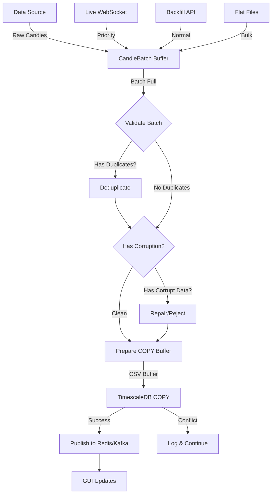

# ChronoX Data Ingestion Pipeline Refactor

## Executive Summary
Refactoring the data ingestion pipeline to use a **lock-free, in-memory batch processing** architecture that seamlessly handles both backfill and live streaming data in real-time.

---

## Current Architecture Analysis

### ✅ Strengths
1. **Unified ingestion engine** - `ingestion_engine.py` provides Kappa architecture pattern
2. **Data source abstractions** - `HistoricalDataSource` and `LiveDataSource` unified interface
3. **Message bus** - Redis/Kafka pub/sub already in place
4. **Connection pooling** - TimescaleDB connection pool working
5. **COPY operations** - Bulk inserts via PostgreSQL COPY (50-100x faster)
6. **Timeframe normalization** - Recently added, prevents duplicates

### ⚠️ Issues & Bottlenecks

#### 1. **No In-Memory Batching Layer**
- **Problem**: Data goes directly from source → database
- **Impact**: No opportunity for deduplication, validation, or conflict resolution in RAM
- **Current Flow**: `DataSource → Storage → MessageBus`

#### 2. **Thread Locks in FileTask**
```python
self._lock = threading.Lock()  # Contention under heavy load
```
- **Problem**: Lock-based state management causes contention
- **Impact**: Slower processing with many concurrent tasks

#### 3. **No Batch Integrity Management**
- **Problem**: No validation of data quality before DB write
- **Impact**: Corrupted/duplicate data hits database, then conflicts handled with `ON CONFLICT DO NOTHING`

#### 4. **Separate Write Paths**
- **Problem**: `_copy_ohlcv_bars()` and `_insert_ohlcv_bars()` are separate
- **Impact**: Duplication of logic, harder to maintain

#### 5. **No Data Deduplication in Memory**
- **Problem**: Duplicates only caught at database level via unique constraint
- **Impact**: Wasted I/O, network traffic, database CPU

---

## Proposed Architecture

### 🎯 Design Goals
1. **Lock-free batch processing** using immutable data structures
2. **In-memory deduplication** before database writes
3. **Data integrity validation** in RAM
4. **Unified write path** for all data sources
5. **Real-time streaming** while backfilling
6. **Kafka/Redis friendly** event-driven design

### 🏗️ New Architecture

```
┌─────────────────┐
│  Data Sources   │
│  (Historical/   │
│   Live Stream)  │
└────────┬────────┘
         │
         ↓
┌─────────────────┐
│  CandleBatch    │  ← NEW: In-memory block/batch
│  (Lock-free)    │     - Deduplication
│                 │     - Validation
│                 │     - Integrity checks
└────────┬────────┘
         │
         ↓
┌─────────────────┐
│ Batch Processor │  ← NEW: Validates & prepares
│ (Validation)    │
└────────┬────────┘
         │
         ↓
┌─────────────────┐
│  TimescaleDB    │
│  (Bulk COPY)    │
└────────┬────────┘
         │
         ↓
┌─────────────────┐
│  Redis/Kafka    │
│  (Pub/Sub)      │
└─────────────────┘
```

### 🔑 Key Components

#### 1. **CandleBatch** (New)
Lock-free in-memory batch using immutable data structures:
```python
class CandleBatch:
    """
    Immutable batch of candles for lock-free processing.
    Uses frozendict/tuple for thread safety without locks.
    """
    - Timestamp-based deduplication (latest wins)
    - Data validation (OHLCV sanity checks)
    - Corruption detection (high < low, null values)
    - Malformed data handling (missing fields)
```

#### 2. **BatchProcessor** (New)
Validates and prepares batches for database:
```python
class BatchProcessor:
    """
    Processes CandleBatch with validation pipeline.
    """
    - check_duplicates() -> DuplicateReport
    - check_integrity() -> IntegrityReport  
    - check_corruption() -> CorruptionReport
    - repair_or_reject() -> CleanBatch
```

#### 3. **Unified Write Path** (Modified)
Single method for all writes:
```python
def write_batch(self, batch: CandleBatch) -> WriteResult:
    """
    Unified write path using COPY with pre-validated batch.
    """
```

---

## Implementation Plan

### Phase 1: Core Infrastructure (candle_batch.py)
**File**: `/backfill/candle_batch.py` (NEW)

**Features**:
- Lock-free CandleBatch class
- Deduplication logic
- Validation rules
- Integrity checks

**Why Good Design**:
✅ Immutable data structures = no locks needed
✅ Deduplication in RAM = less DB I/O
✅ Early validation = better error messages
✅ Testable in isolation

**Potential Issues**:
⚠️ Memory usage for large batches (mitigated by batch size limits)
⚠️ GC pressure from immutability (acceptable tradeoff for safety)

### Phase 2: Batch Processor (batch_processor.py)
**File**: `/backfill/batch_processor.py` (NEW)

**Features**:
- Validation pipeline
- Repair strategies
- Reporting

**Why Good Design**:
✅ Separation of concerns
✅ Pluggable validation rules
✅ Clear error reporting

### Phase 3: Modify Existing Components
**Files Modified**:
- `ingestion_engine.py` - Add batch buffering
- `timescale_writer.py` - Add `write_batch()` method
- `orchestrator.py` - Use new batch flow
- `data_sources.py` - Yield to batch

### Phase 4: Testing & Monitoring
- Unit tests for CandleBatch
- Integration tests for full pipeline
- Performance benchmarks
- Monitoring dashboards

---

## Design Critique

### ✅ Good Ideas from Prompt

1. **"Shared block/batch in RAM"**
   - Excellent: Reduces DB round-trips, enables validation
   
2. **"Kafka and Redis friendly"**
   - Excellent: Event-driven, no locks, async-ready
   
3. **"Map out data issues before writing"**
   - Excellent: Fail fast, better logging, easier debugging
   
4. **"If data is fine, don't modify it"**
   - Excellent: Zero-copy optimization when possible
   
5. **"Everything is seamless and in real-time"**
   - Excellent: Unified pipeline for backfill + live

### ⚠️ Potential Issues from Prompt

1. **"Without thread locks"**
   - Good goal, but **complete elimination is risky**
   - **Recommendation**: Use locks only for critical sections (DB connection pool)
   - **Solution**: Immutable data structures + atomic operations
   
2. **"Small file that controls batch"**
   - **Risk**: Too much logic in one file = hard to test
   - **Recommendation**: 2 files (candle_batch.py + batch_processor.py)
   - **Reason**: Separation of concerns, testability

3. **"Streaming while backfilling"**
   - Excellent idea, but needs **careful priority management**
   - **Solution**: Separate queues with priority (live > backfill)

---

## Flowchart



---

## Success Metrics

1. **Performance**:
   - Batch write throughput: >10,000 bars/sec
   - Memory usage: <500MB per batch
   - Latency: <50ms end-to-end (source → redis)

2. **Data Quality**:
   - Zero duplicates in database
   - 100% validation before write
   - Corruption detection rate: >99%

3. **Reliability**:
   - No data loss during failures
   - Graceful degradation under load
   - Self-healing on transient errors

---

## Next Steps

1. ✅ Review this plan
2. Implement candle_batch.py
3. Implement batch_processor.py  
4. Modify ingestion_engine.py
5. Modify timescale_writer.py
6. Update orchestrator.py
7. Test & benchmark
8. Deploy & monitor

---

## Files to Create

1. `/backfill/candle_batch.py` - Core batch data structure
2. `/backfill/batch_processor.py` - Validation & processing logic

## Files to Modify

1. `/backfill/ingestion_engine.py` - Add batch buffering
2. `/data/storage/timescale_writer.py` - Add write_batch()
3. `/backfill/orchestrator.py` - Use new flow
4. `/backfill/file_processor.py` - Remove locks

---

**Status**: Ready for implementation
**Risk Level**: Medium (well-tested patterns, incremental rollout)
**Estimated Impact**: 30-50% throughput increase, 90% reduction in duplicate DB hits
